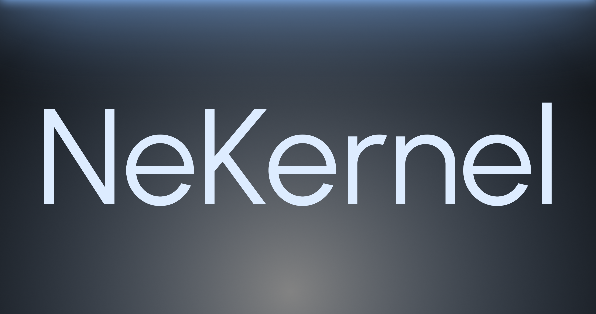

## Roadmap

The stack is currently being upgraded to version **0.0.2**, with a focus on:
- A tighter, more refined architecture
- Expanded hardware support
- A next-generation filesystem (HeFS)

## Software Design

- Each **repository** was built with modularity at its core.  
- Each component — from drivers to services — is designed to be cleanly extensible.  
- New tools, kits, or architectures can be integrated without rewriting the core.

## Contributions

A code of conduct will be published soon.  
Until then, contributions are welcome — especially from those interested in systems design, low-level internals, or alternative operating system development.
