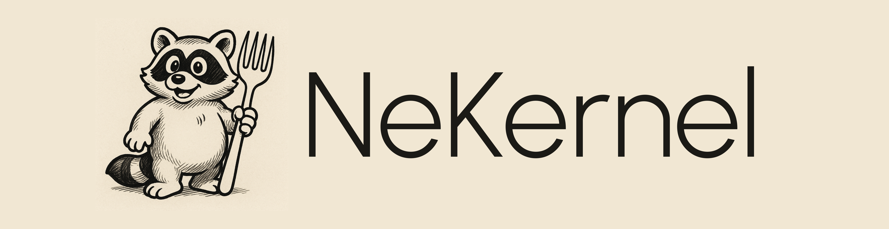

## Project Description

Free and Open-Source Operating System Stack.

## Project Roadmap

Currently working towards the 0.0.3 release, stay tuned for updates in the Discord server!

## Project Philosophy 

- Each **repository** was built with modularity at its core.  
- Each **component** from **drivers** to **services** is designed to be cleanly extensible.  
- New **tools**, **kits**, or **architectures** can be integrated without rewriting the core.
